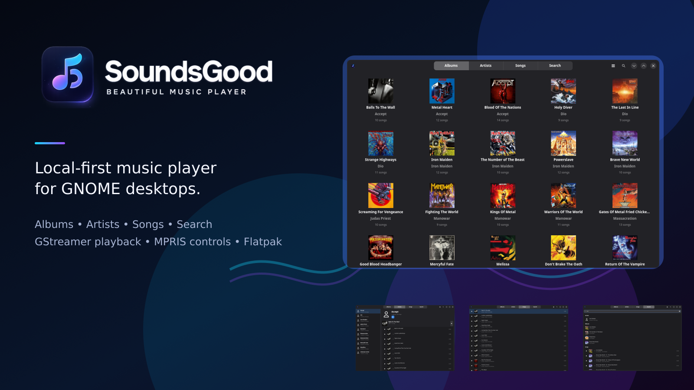

# SoundsGood



[](COPYING)
[](https://github.com/N1ghthill/soundsgood/releases)
[](#installation)
[](https://gtk.org/)

SoundsGood is a local music player for Linux, built with Python,
GTK4/libadwaita, and GStreamer. It focuses on a clean library experience for
music stored on your computer: albums, artists, songs, search, playback queue,
and desktop media controls.

The project is inspired by the GNOME Music experience, but keeps a narrower
scope: local files first, no streaming, no podcasts, and no radio service
integration.

## OpenAI Build Week 2026

SoundsGood participates in the **Apps for your life** track of OpenAI Build
Week. Codex helped audit and improve the application lifecycle, asynchronous
library scan, cache safety, GTK rendering model, adaptive UI, tests, and
submission workflow. Product scope and key architectural decisions remained
human-owned: native GNOME technology, local-first playback, no accounts, and no
streaming dependency.

The implementation record, human decisions, Codex session traceability, and
submission checklist are documented in [docs/BUILD_WEEK.md](docs/BUILD_WEEK.md)
and [docs/SUBMISSION.md](docs/SUBMISSION.md). The final recording script is in
[docs/DEMO_SCRIPT.md](docs/DEMO_SCRIPT.md).

## Screenshots


| Artists | Songs |
| --- | --- |
|  |  |


## Features

- Browse local music by albums, artists, and songs.
- Search by title, artist, album, album artist, genre, and year.
- Open local audio files from the file manager when SoundsGood is the default
  music app.
- Open `.m3u`, `.m3u8`, and `.pls` playlists as temporary playback queues.
- Play local audio through GStreamer.
- Control playback with play/pause, previous, next, seek, volume, repeat, and
  shuffle.
- Manage the current queue from the player toolbar.
- Read real file metadata and embedded album art when available.
- Use common folder artwork names such as `cover.jpg`, `folder.png`,
  `front.jpg`, and `album.png`.
- Cache the music library in `$XDG_CACHE_HOME/soundsgood/library.json`.
- Reopen from the cached library index when the indexed files and folders have
  not changed.
- Watch the music folder and rescan after file changes.
- Choose a music folder directly from empty library states.
- Reindex the library manually when metadata needs to be refreshed.
- Expose MPRIS controls on `org.mpris.MediaPlayer2.SoundsGood`.
- Show optional desktop notifications for the current track.
- Prevent session suspend while music is playing.

## Installation

SoundsGood is distributed through its own signed Flatpak repository. Add the
repository once, then install the app:

```bash
flatpak remote-add --user --if-not-exists soundsgood https://n1ghthill.github.io/soundsgood/soundsgood.flatpakrepo
flatpak install --user soundsgood io.github.n1ghthill.soundsgood
flatpak run io.github.n1ghthill.soundsgood
```

Updates are handled by Flatpak:

```bash
flatpak update --user io.github.n1ghthill.soundsgood
```

Versioned Flatpak bundles are also available on
[GitHub Releases](https://github.com/N1ghthill/soundsgood/releases).

## Latest Release

SoundsGood 0.1.6 adds playlist opening for `.m3u`, `.m3u8`, and `.pls` files.
The previous 0.1.5 release fixed opening audio files from the file manager when
SoundsGood is configured as the default music app.

## Command Line

For Flatpak installations, run SoundsGood from a terminal with:

```bash
flatpak run io.github.n1ghthill.soundsgood
```

You can also pass local audio files or supported playlists:

```bash
flatpak run io.github.n1ghthill.soundsgood ~/Music/song.mp3 ~/Music/mix.m3u
```

## Development

### Dependencies

- Python 3.10+
- GTK4
- libadwaita
- PyGObject
- GStreamer
- Meson
- Ninja

### Build and Run

```bash
meson setup builddir
meson compile -C builddir
./builddir/local-soundsgood
```

You can also run the application directly during development:

```bash
python3 -m soundsgood.application
```

### Reproducible Demo Library

Judges and contributors can generate a small local library without downloading
copyrighted media:

```bash
scripts/create-demo-library.sh
```

Start SoundsGood and select the generated `demo-music` folder. The script uses
GStreamer to create four short WAV test tracks and requires no account, API key,
or network access.

### Tests

```bash
python3 -m py_compile soundsgood/*.py soundsgood/catalog/*.py soundsgood/views/*.py soundsgood/widgets/*.py tests/*.py
python3 -m unittest discover -s tests
meson test -C builddir
```

GTK smoke tests can be run in a virtual display and D-Bus session:

```bash
dbus-run-session -- xvfb-run -a python3 -m unittest tests.test_ui
```

Runtime diagnostics are written to
`$XDG_STATE_HOME/soundsgood/soundsgood.log` (or
`~/.local/state/soundsgood/soundsgood.log`) and can be opened from Preferences.

## Flatpak

The local Flatpak manifest is `io.github.n1ghthill.soundsgood.yml`.

Build and install locally:

```bash
flatpak install org.gnome.Platform//50 org.gnome.Sdk//50 org.flatpak.Builder
flatpak run org.flatpak.Builder --user --install --force-clean build-flatpak io.github.n1ghthill.soundsgood.yml
flatpak run io.github.n1ghthill.soundsgood
```

More packaging notes are available in [docs/FLATPAK.md](docs/FLATPAK.md).

## Media Kit

Generated presentation assets are available in [docs/assets](docs/assets):

- [Project banner](docs/assets/soundsgood-hero.png)
- [Social preview card](docs/assets/soundsgood-social-card.png)
- [Release card](docs/assets/soundsgood-release-card.png)
- [Feature montage](docs/assets/soundsgood-feature-montage.png)

Regenerate them after updating screenshots, branding, or the project version:

```bash
scripts/generate-assets.sh
```

## Project Status

SoundsGood is a functional local-first MVP moving toward beta quality. It can
scan a local music folder, reopen quickly from a persistent library index,
search tracks, play audio, expose media controls, and run from Flatpak. The
current focus is regression testing with larger collections, CI validation, and
polish for narrow screens and accessibility.

Known areas still planned:

- More regression testing with large real-world music collections.
- Deeper keyboard and screen-reader accessibility review.
- Diagnostics for files with unreadable or incomplete metadata.

See [ROADMAP.md](ROADMAP.md) for the development roadmap.

## Architecture

The application is organized around a small set of modules:

- `Application`: startup, settings, library, player wiring, and opened files.
- `Library`: local file discovery, metadata extraction, cache, and models.
- `Player`: GStreamer playback, queue, progress, volume, repeat, and shuffle.
- `Models`: GObject models for songs, albums, artists, and player state.
- `Views`: albums, artists, songs, search, and detail screens.
- `Widgets`: reusable UI components such as the toolbar, song rows, and dialogs.

See [docs/ARCHITECTURE.md](docs/ARCHITECTURE.md) for details.

## License

SoundsGood is released under the GPL-2.0-or-later license. See
[COPYING](COPYING).
