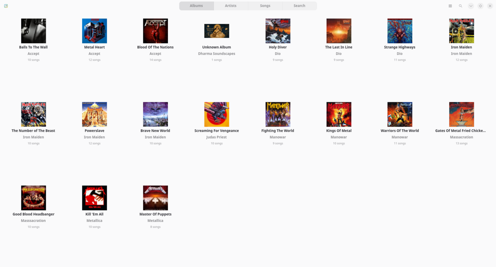
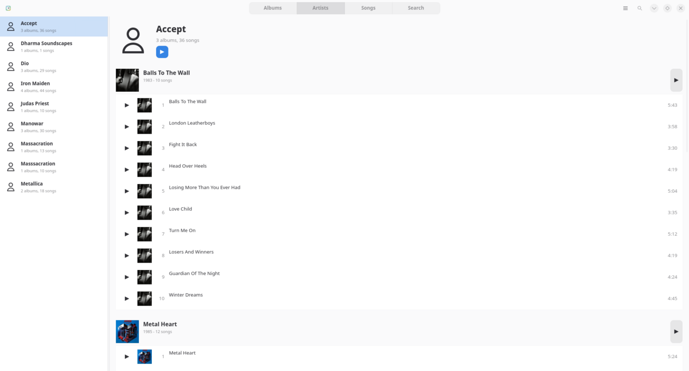
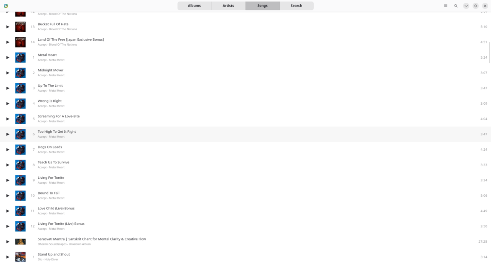
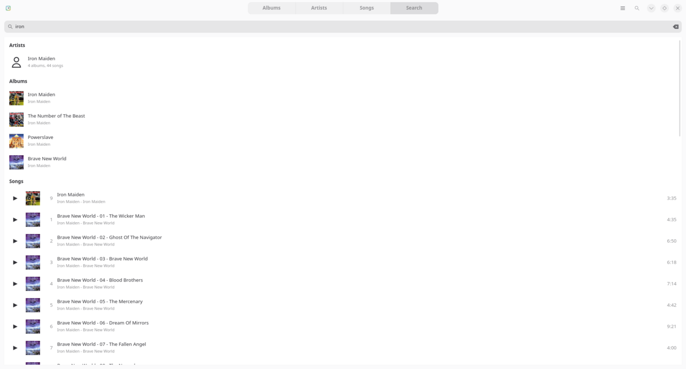

# SoundsGood

[](COPYING)
[](https://github.com/N1ghthill/soundsgood/releases)
[](#installation)
[](https://gtk.org/)

SoundsGood is a local music player for Linux, built with Python,
GTK4/libadwaita, and GStreamer. It focuses on a clean library experience for
music stored on your computer: albums, artists, songs, search, playback queue,
and desktop media controls.

The project is inspired by the GNOME Music experience, but keeps a narrower
scope: local files first, no streaming, no podcasts, and no radio service
integration.

## Screenshots



| Artists | Songs |
| --- | --- |
|  |  |



## Features

- Browse local music by albums, artists, and songs.
- Search by title, artist, album, album artist, genre, and year.
- Play local audio through GStreamer.
- Control playback with play/pause, previous, next, seek, volume, repeat, and
  shuffle.
- Manage the current queue from the player toolbar.
- Read real file metadata and embedded album art when available.
- Use common folder artwork names such as `cover.jpg`, `folder.png`,
  `front.jpg`, and `album.png`.
- Cache the music library in `$XDG_CACHE_HOME/soundsgood/library.json`.
- Watch the music folder and rescan after file changes.
- Expose MPRIS controls on `org.mpris.MediaPlayer2.SoundsGood`.

## Installation

### GitHub Release

Until SoundsGood is available on Flathub, install the Flatpak bundle from the
latest GitHub release:

```bash
wget https://github.com/N1ghthill/soundsgood/releases/download/v0.1.1/SoundsGood-0.1.1-x86_64.flatpak
flatpak install --user ./SoundsGood-0.1.1-x86_64.flatpak
flatpak run io.github.n1ghthill.soundsgood
```

### Flathub

The Flathub submission is in progress. After it is accepted, installation will
use the normal Flathub command:

```bash
flatpak install flathub io.github.n1ghthill.soundsgood
flatpak run io.github.n1ghthill.soundsgood
```

## Development

### Dependencies

- Python 3.10+
- GTK4
- libadwaita
- PyGObject
- GStreamer
- Meson
- Ninja

### Build and Run

```bash
meson setup builddir
meson compile -C builddir
./builddir/local-soundsgood
```

You can also run the application directly during development:

```bash
python3 -m soundsgood.application
```

### Tests

```bash
python3 -m py_compile soundsgood/*.py soundsgood/views/*.py soundsgood/widgets/*.py tests/*.py
python3 -m unittest discover -s tests
meson test -C builddir
```

## Flatpak

The local Flatpak manifest is `io.github.n1ghthill.soundsgood.yml`.

Build and install locally:

```bash
flatpak install flathub org.gnome.Platform//50 org.gnome.Sdk//50 org.flatpak.Builder
flatpak run org.flatpak.Builder --user --install --force-clean build-flatpak io.github.n1ghthill.soundsgood.yml
flatpak run io.github.n1ghthill.soundsgood
```

More packaging notes are available in [docs/FLATPAK.md](docs/FLATPAK.md).

## Project Status

SoundsGood is an early but functional MVP. It can scan a local music folder,
build a library, search tracks, and play audio. The current focus is stability,
metadata quality, Flatpak packaging, and polish for the local library workflow.

Known areas still planned:

- More testing with real-world music collections.
- Better persistent indexing to avoid walking the full music tree on every
  startup.
- Desktop notifications.
- Optional session inhibition while music is playing.

See [ROADMAP.md](ROADMAP.md) for the development roadmap.

## Architecture

The application is organized around a small set of modules:

- `Application`: startup, settings, library, and player wiring.
- `Library`: local file discovery, metadata extraction, cache, and models.
- `Player`: GStreamer playback, queue, progress, volume, repeat, and shuffle.
- `Models`: GObject models for songs, albums, artists, and player state.
- `Views`: albums, artists, songs, search, and detail screens.
- `Widgets`: reusable UI components such as the toolbar, song rows, and dialogs.

See [docs/ARCHITECTURE.md](docs/ARCHITECTURE.md) for details.

## License

SoundsGood is released under the GPL-2.0-or-later license. See
[COPYING](COPYING).
